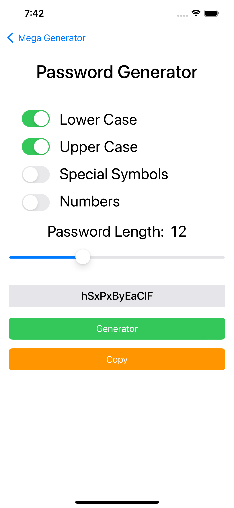

Mega Genrot
==========
An application for generating names, numbers, flipping a coin, custom list and creating a password from a multiple choice of a lowercase letter, an uppercase letter, Special Symbols. The app can make a random number (from, to). A quick copy can be made for convenience, the user can generating from custom list A random selection from a customized list that the user enters .

## Screenshots
  

    &nbsp;&nbsp;
  &nbsp;&nbsp;
    &nbsp;&nbsp;
      &nbsp;

## Download From App Store
 

